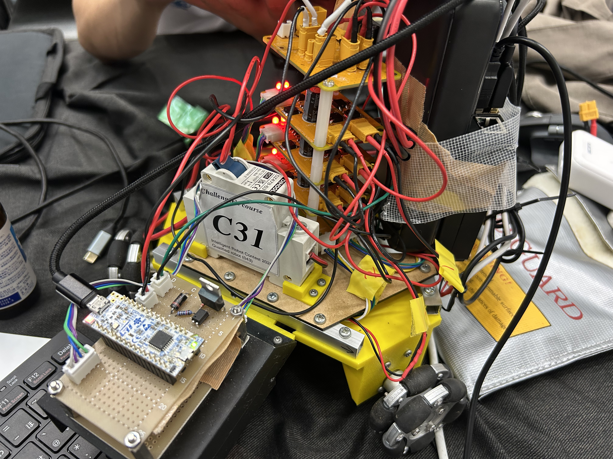

# T-semi 二郎部 やさろぼ

# Hardware


# 環境構築
## 実行に必要なライブラリ
- ros2 humble
- rosdep
- BehaviorTree
- gazebo

## あれば嬉しい
- Groot2
    - GUIでBehaivorTreeのシーケンスを組めるもの
    - たしかUbuntu限定（wslでもできるかも？）

### ros2 humble
[公式の手順](https://docs.ros.org/en/humble/Installation/Ubuntu-Install-Debs.html)にしたがってインストール

### rosdep
```bash
sudo apt-get install python3-rosdep
```
初期化と更新もしておく
```bash
sudo rosdep init
rosdep update
```

### colconのインストール
```bash
sudo apt install -y python3-colcon-common-extensions
```

### BaheaivorTreeのインストール
```bash
sudo apt install libzmq3-dev libboost-dev qtbase5-dev libqt5svg5-dev libzmq3-dev libdw-dev
cd
git clone https://github.com/BehaviorTree/BehaviorTree.CPP.git
cd BehaviorTree.CPP
mkdir build
cd build
cmake ..
make -j8
sudo make install
cd ros_ws
```

### gazeboのインストール
```bash
sudo apt -y install gazebo
sudo apt install ros-humble-gazebo-*
. /usr/share/gazebo/setup.sh
```

### rosのworkspaceを作成
```bash
cd
mkdir -p ros_ws/src
```
各パッケージは`ros_ws/src/`においていきます

### ros2のパッケージのインストール
Lidarのパッケージと、プロセス間通信の型についてのパッケージがあるので、それぞれインストール
まずはLidarのパッケージ
```bash
cd
cd ros_ws/src
git clone https://github.com/keigo1216/ldrobot-lidar-ros2
cd ldrobot-lidar-ros2
git checkout humble
```

```bash
sudo apt install libudev-dev
sudo apt install libopencv-dev
```

```bash
cd ~/ros_ws/src/ldrobot-lidar-ros2/scripts/
./create_udev_rules.sh
```

次に型のパッケージ
```bash
cd
cd ros_ws/src
git clone https://github.com/keigo1216/inrof2025_ros_type.git
cd inrof2025_ros_type
colcon build --packages-select inrof2025_ros_type
```

### メインのプログラムのインストール
このリポジトリのプログラムをインストールします
```bash
cd
cd ros_ws/src
git clone https://github.com/T-semi-Tohoku-Uni/yasarobo2025_26
```

## 環境設定
### シミュレーションで実行する場合
gazeboに表示するモデルのパスを設定
```bash
echo 'export GAZEBO_MODEL_PATH=$HOME/ros_ws/install/yasarobo2925_26/share/yasarobo2925_26/models/:${GAZEBO_MODEL_PATH}' >> ~/.bashrc
```
`WITH_SIM`環境変数を`1`に設定（`0`にすると実機バージョンでビルドされるので注意）
```bash
echo `export WITH_SIM=1 >> ~/.bashrc`
``` 

### 実機で実行する場合
手元のパソコンにrvizの出力などを表示させるために、ドメインやipを設定します（ラズパイ、手元のパソコンの両方で実行）
```bash
echo 'export ROS_DOMAIN_ID=1' >> ~/.bashrc
ros2 daemon stop
ros2 daemon start
```

`192.168.0.180`は、その機器のipアドレスに設定。（`ifconfig`を打てばわかる）
```bash
echo 'export ROS_IP=192.168.0.180' >> ~/.bashrc
```

## 実行方法
ビルド
```bash
cd 
cd ros_ws
colcon build --packages-select yasarobo2925_26
```
実行
```bash
source install/setup.bash
ros2 launch yasarobo2925_26 simulation.launch.py
```